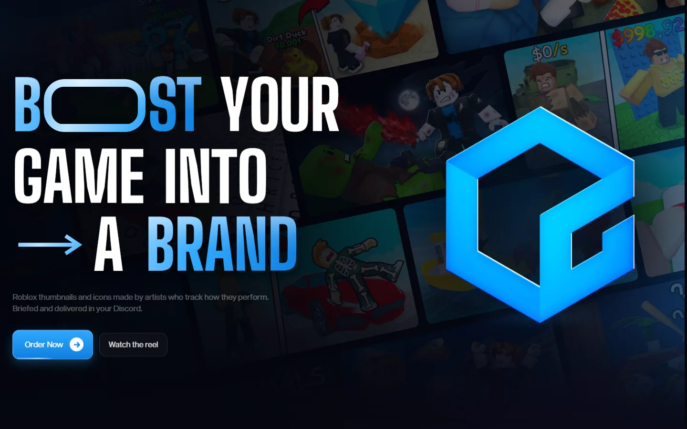
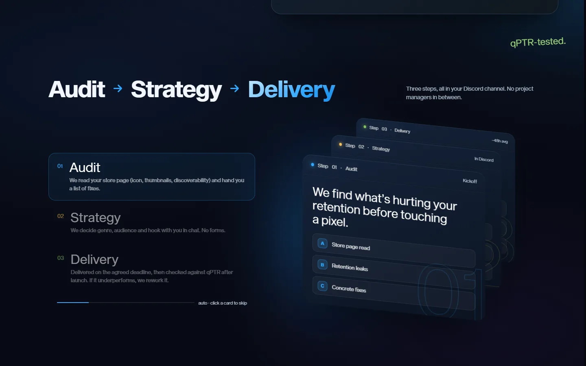
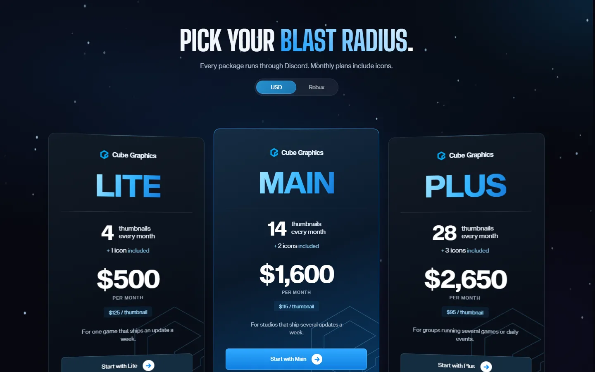
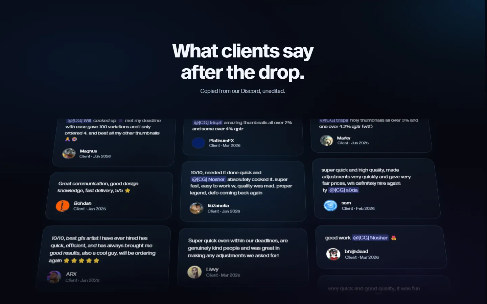

  

<h1 align="center">Cube Graphics</h1>

  Site do estúdio de thumbnails e ícones para jogos Roblox. 
  <a href="https://cubegraphics.org"><strong>cubegraphics.org</strong></a>

  

## Sobre

A Cube Graphics faz thumbnails e ícones para jogos Roblox e acompanha o desempenho de cada peça depois que ela vai ao ar. O site apresenta o estúdio, explica como o trabalho funciona e mostra os pacotes mensais.

Todo o atendimento acontece no Discord. O site foi pensado para levar o visitante até lá com as informações que ele precisa antes de mandar mensagem: o que é entregue, como o processo funciona, quanto custa e o que outros clientes disseram.

## O que tem no site

**Reel do estúdio.** Um vídeo curto com o trabalho, com controle de volume na própria página.

**Performance medida.** Uma barra interativa mostra o qPTR (qualified play-through rate, a métrica do próprio Roblox para quantas impressões viram sessões de jogo) em relação à mediana do mercado. Dá para arrastar e comparar percentis.

**Processo em três etapas.** Auditoria, estratégia e entrega, com cards que trocam sozinhos ou ao clique.

  

**Portfólio.** Parede de thumbnails feitas pelo estúdio, com lightbox para ver em tamanho cheio.

**Pacotes.** Três planos mensais com preço em dólar ou em Robux. A troca de moeda é feita na página.

  

**Workflow.** Uma simulação de canal do Discord mostra as seis etapas de um pedido, do fechamento à entrega, conforme a página rola.

**Depoimentos.** Mensagens de clientes copiadas do Discord, sem edição.

  

## Como foi feito

Página única em HTML, CSS e JavaScript, sem framework. As animações usam [GSAP](https://gsap.com) com ScrollTrigger, e a rolagem suave é do [Lenis](https://lenis.darkroom.engineering). A hospedagem é na Cloudflare, com um Worker servindo os arquivos estáticos.

Os dados das seções (pacotes, etapas, mensagens do workflow) ficam em objetos JavaScript dentro da própria página, para facilitar a edição sem mexer no HTML.

## Equipe

| Quem | O que fez | Links |
|---|---|---|
| **S0DA** | Primeira reforma do site, revisão final e publicação. | [X](https://x.com/gfxs0da) · [GitHub](https://github.com/dgolaus) |
| **Trispil** | Segunda reforma, a versão que está no ar. | [X](https://x.com/gfxtrispil) · [GitHub](https://github.com/trispil) |
| **Lyus** | Segunda reforma, a versão que está no ar. | [X](https://x.com/gfxlyus) · [GitHub](https://github.com/ilyuszz) |
| **Art** | Segunda reforma, a versão que está no ar. | [X](https://x.com/artpsdd) · [GitHub](https://github.com/Artt4sec) |
| **Juan** | Fez o site original. A estrutura atual (seções, headline, pacotes) vem dele. | [X](https://x.com/JuanArtxz) · [GitHub](https://github.com/JuanArtxz) |

## Direitos

Este repositório serve para apresentar o projeto. O código-fonte, as imagens e o conteúdo do site pertencem à Cube Graphics e não estão liberados para reuso.
